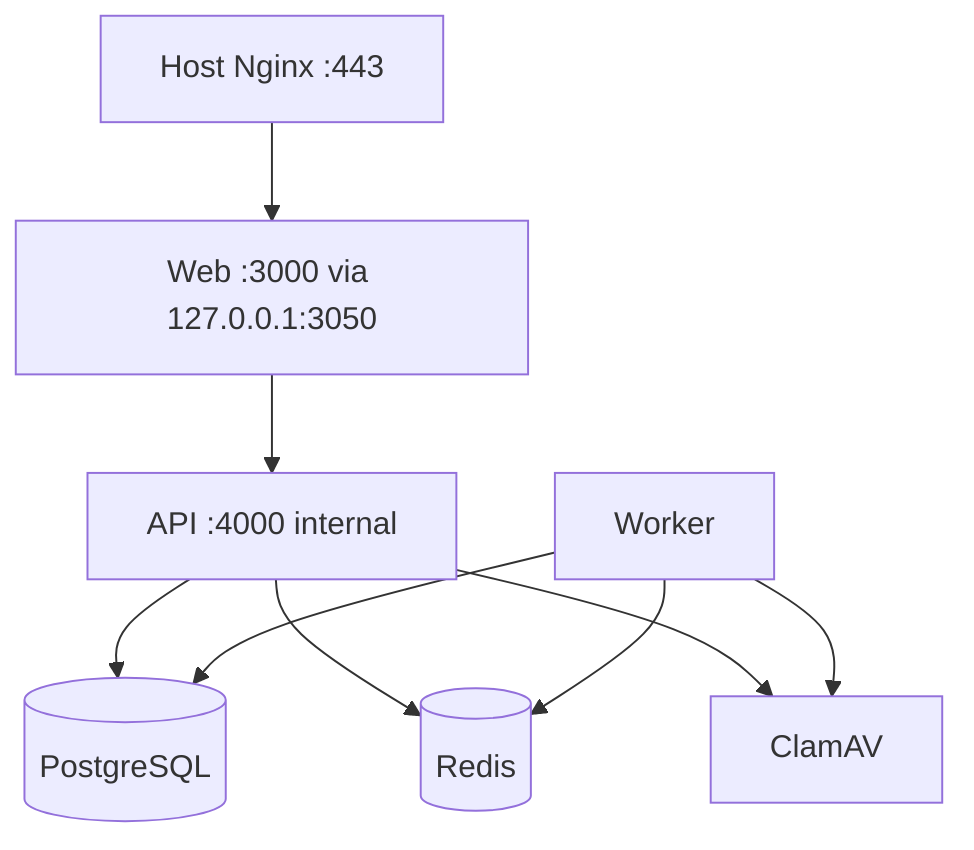

# Architecture

> Current repository state (2026-09-04): a fresh replacement frontend and web runtime have been implemented from the owner-approved direction. The production launch gates below remain authoritative and intentionally fail closed.

## Shape

Use a modular pnpm monorepo with physically separate web and API applications:

```text
apps/
  web/        Next.js UI, SSR/SEO, customer/admin shells
  api/        Fastify HTTP API and worker entrypoint
packages/
  contracts/  shared schemas and generated API types only
  db/         Drizzle schema, migrations, seed factories
  config/     narrow typed config shared by apps
infra/
  nginx/      host reverse-proxy example
  scripts/    deploy, backup, restore, health, preflight
tests/
  e2e/        Playwright journeys and visual baselines
```

Do not create a generic framework, repository layer hierarchy, microservices, event bus, GraphQL server, Kubernetes manifests, or multi-tenant platform. Keep domain modules inside `apps/api`: auth, organizations, requests, files, screening, offers, orders, payments, notifications, content, complaints, admin, audit, and system health.

## Runtime topology



Only the web service is bound to the host, on `127.0.0.1:3050`. Next.js rewrites `/api/*` to the internal API service. The host Nginx owns TLS, canonical redirects, request-size ceilings, security headers that do not depend on app state, and proxy timeouts.

## Technology decisions

- TypeScript strict mode throughout.
- Next.js App Router for public pages, customer account, offer/payment views, and admin UI.
- Fastify with JSON Schema/TypeBox or Zod-based validation at every trust boundary; choose one schema system and reuse it for OpenAPI.
- PostgreSQL is the source of truth. Drizzle migrations are forward-only and committed.
- Redis handles bounded ephemeral state: rate limits, OTP challenges, sessions/deny-list, notification jobs, and idempotency locks. Durable job/outbox state remains in PostgreSQL.
- REST JSON API under `/api/v1`; generate an OpenAPI document and typed web client from the same schemas where practical.
- Use secure HTTP-only cookies for opaque session IDs. Avoid browser storage for auth tokens.
- Use a small, explicit state-transition module backed by database transactions; no workflow engine.
- Use server-rendered public content for SEO. Admin/customer pages may be dynamic and `noindex`.
- Use a small component system built from accessible primitives. Do not adopt a large theme framework.

At R0, resolve and pin supported stable versions. Record runtime versions in `.tool-versions` or equivalent and container images by immutable version (digest for production where practical).

## Domain invariants

- Users are human representatives; organizations are legal customers.
- The database supports Membership, while the MVP UI has one active organization.
- Customers may view only their own profile and request list; internal states and notes are never serialized in customer DTOs.
- Only a `QUALIFIED` request can create an initial-assessment offer.
- Offers are versioned. A paid offer cannot be destructively edited.
- Public offer access uses a random >=128-bit token stored only as a hash. Revocation and expiry are checked on every read/action.
- Amounts are integer IRR. Server computes base, tax, and total; the client never supplies a trusted total.
- One order may have multiple payment attempts but only one terminal collection outcome. Unique constraints and idempotency keys protect callback replay.
- Consent and audit rows are append-only from the application.
- Attachments are quarantined until MIME validation and ClamAV pass. Downloads require authorization and short-lived, single-purpose access.
- Physical deletion of financial, consent, and audit rows is not available in the normal UI.

## Key tables

Implement the PRD entities plus narrow supporting tables:

- `users`, `organizations`, `memberships`, `sessions`, `otp_challenges`, `mfa_factors`
- `requests`, `attachments`, `screenings`, `request_assignments`
- `offers`, `offer_versions`, `orders`, `payments`, `bank_transfers`, `refund_records`
- `notification_templates`, `notifications`, `outbox_jobs`
- `content_entries`, `content_revisions`, `case_studies`, `clients`, `team_members`, `legal_documents`
- `consent_logs`, `complaints`, `audit_logs`, `error_events`, `product_events`, `app_settings`

Use UUIDv7 (or a database-supported time-sortable UUID) internally. Public references use a non-sequential prefix plus random Crockford/Base32 segment, e.g. `REQ-1405-7M4K9Q2D`. Offer URL tokens are independent cryptographic random values.

## Provider boundaries

Define thin interfaces with contract tests:

- `SmsProvider`: mock and Kavenegar
- `EmailProvider`: mock and SMTP
- `PaymentProvider`: mock and future approved gateway
- `CaptchaProvider`: dev bypass and Cloudflare Turnstile (or approved equivalent)
- `FileScanner`: ClamAV only in production; deterministic fake for unit tests
- `Clock` and `IdGenerator` only where deterministic testing genuinely needs them

Mocks are selected only by explicit non-production configuration. Production config validation rejects mock providers and missing secrets.

## API and concurrency rules

- Every mutation accepts or generates an idempotency key where duplicate browser/network submission is plausible.
- Use transactions plus unique indexes, not process memory, for financial and request deduplication.
- Callback processing verifies provider status server-side before state transition.
- Use optimistic concurrency/version columns for admin content and offer edits.
- Notification retry is bounded with exponential backoff, dead-letter status, provider reference, and manual retry authorization.
- Rate limits combine IP, mobile, session/user, route risk, and trusted proxy parsing. Do not trust arbitrary forwarded headers.

## Performance and resource budget

The host has 4 GB RAM. Initial Compose limits should target roughly:

| Service | Memory target |
|---|---:|
| Web | 512 MB |
| API | 512 MB |
| Worker | 256 MB |
| PostgreSQL | 768 MB |
| Redis | 192 MB |
| ClamAV | 1,024 MB |
| Headroom/host Nginx | ~832 MB |

Measure rather than assume. Avoid running heavy observability suites on this host. Public pages should be cacheable where safe; user/offer/payment responses must be private/no-store. Add DB indexes from actual query plans for admin search and status/date filters.

## Repository boundaries

- `apps/web` cannot import database code.
- `apps/api` cannot import UI code.
- `packages/contracts` contains transport schemas/types, not business services.
- `packages/db` owns schema/migrations and may be imported only by API/worker tooling.
- Provider implementations live behind domain-facing interfaces; do not spread SDK calls across handlers.
